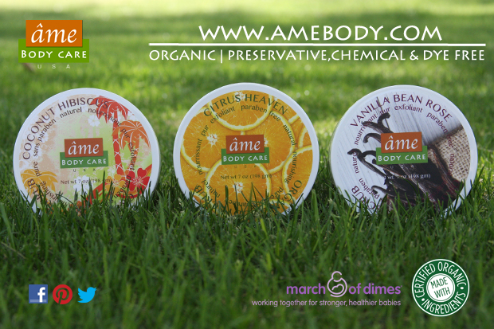

  

## Why your skin deserves organic skin care products

Just like you nourish your body with organic food, your skin deserves care with organic beauty products. Many non-organic beauty products on the market today include an astonishing amount of scary chemicals. From parabens (chemicals linked to cancer) to formaldehyde to petroleum waxes, an ordinary lotion can contain quite the toxic mixture. Certified-organic skincare products cleanse, tone, exfoliate and moisturize your skin without using any of these noxious artificial chemicals or additives. That’s not all, though. Here are a few [more reasons](https://www.organicauthority.com/energetic-health/skincare-organic-beauty-products) to choose organic beauty products for naturally beautiful skin.

